#  Building a SOC Home Lab: Detection & Response Project

Este projeto documenta a construção de um Laboratório de Security Operations Center (SOC) para simular ataques reais e praticar Defesa Cibernética (Blue Team). O objetivo é implementar uma stack completa de monitoramento (ELK), ingerir logs de endpoints e desenvolver habilidades de detecção e resposta a incidentes.

## 📌 Fase 1: Arquitetura e Infraestrutura 

### 1. Arquitetura Lógica
Antes do deploy, foi desenhada a topologia da rede para entender o fluxo de dados e posicionamento dos sensores. O laboratório simula um ambiente corporativo real contendo:

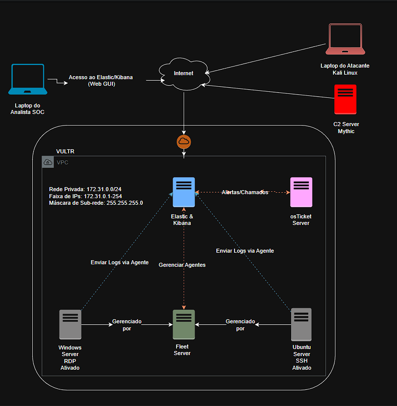
*Diagrama da arquitetura do laboratório desenhado durante o planejamento.*
* **VPC (Virtual Private Cloud):** Para isolamento da rede.
* **SIEM (ELK Stack):** O coração do monitoramento.
* **Endpoints (Windows/Linux):** Alvos que serão monitorados e atacados.
* **C2 Server (Command & Control):** Para simular o atacante externo.

### 2. Provisionamento de Infraestrutura (IaaS)
Utilizei a **Vultr** como provedor de nuvem. A escolha foi baseada na capacidade de configurar redes privadas personalizadas e baixo custo.

**Configurações do Servidor SIEM:**
* **OS:** Ubuntu 22.04 LTS (Estabilidade e suporte da comunidade).
* **Specs:** 2 vCPU, 8GB RAM (Dimensionado para suportar a JVM do Elasticsearch).
* **Região:** Toronto (Para garantir compatibilidade de latência com a VPC).

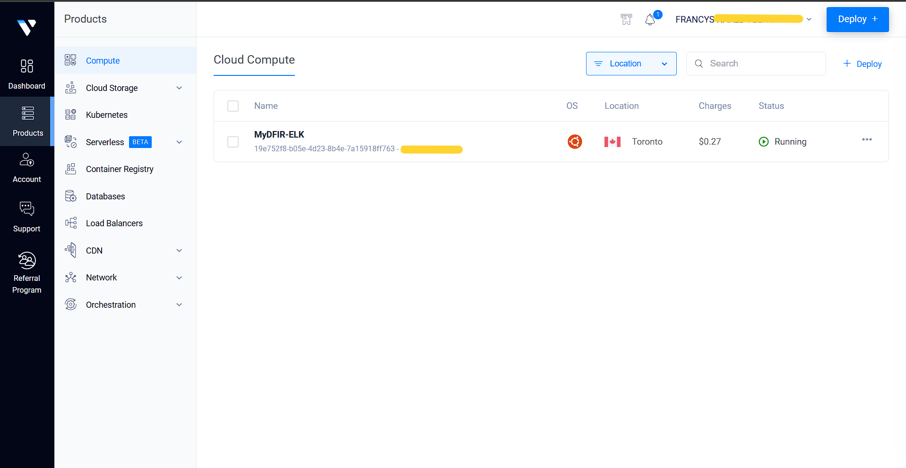
*Deploy da instância Ubuntu Server concluído e rodando.*

### 3. Configuração de Rede e Segurança (Hardening)
A segurança do próprio laboratório foi uma prioridade. Não expus o servidor diretamente sem proteções.

* **VPC Network:** Criei uma rede privada isolada para que os agentes (futuros servidores Windows/Linux) se comuniquem com o SIEM sem trafegar logs sensíveis pela internet pública.
* **Firewall na Nuvem:** Implementei um *Firewall Group* na Vultr seguindo o princípio do menor privilégio.
    * **Porta 22 (SSH):** Restrita apenas ao meu IP atual de gerenciamento.
    * **Porta 9200 (Elasticsearch):** Restrita ao meu IP e à rede interna da VPC.

*Aplicação de regras de firewall restringindo acesso SSH e TCP/9200.*

### 4. Instalação e Configuração do Elasticsearch
Realizei a instalação manual do Elasticsearch via repositório APT oficial, garantindo a versão mais recente e segura.

**Credenciais e Segurança Inicial:**
Durante a instalação, o Elasticsearch gerou automaticamente os tokens de segurança e a senha do superusuário, garantindo que o banco de dados já nasça autenticado.

*Output de segurança pós-instalação com credenciais geradas.*

**Ajustes de Configuração (`elasticsearch.yml`):**
Para permitir que o servidor receba conexões externas (do meu laptop de analista e dos agentes), precisei alterar as configurações de *binding* de rede, saindo do padrão `localhost`.

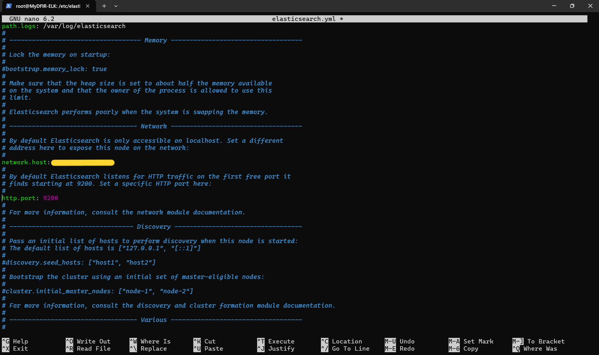
*Edição do arquivo YAML definindo o host de rede público e a porta padrão 9200.*

**Status do Serviço:**
Após a configuração e recarga dos *daemons*, o serviço subiu com sucesso e está ativo.

*Validação do serviço rodando via SystemD.*

---

### ⚠️ Desafios e Soluções (Troubleshooting)

Durante essa fase inicial, enfrentei desafios técnicos reais de ambiente Cloud que exigiram adaptação:

**1. Cota de Recursos na Cloud (Resource Quotas)**
Ao tentar provisionar a máquina de 16GB, fui bloqueada pela política de cota para novas contas ("Monthly Fee Limit Reached").

*Erro de limite de provisionamento encontrado.*

* **Solução:** Realizei o *downsizing* estratégico para uma instância de 8GB RAM e otimizei o servidor. Isso permitiu continuar o laboratório dentro do orçamento e das limitações da conta, sem perder funcionalidade crítica.

**3. IP Dinâmico (CGNAT)**
Meu provedor de internet altera o IP frequentemente, o que bloqueava meu acesso às regras restritas do Firewall.
* **Solução:** Aprendi a monitorar meu IP público e atualizar as regras de *Ingress* dinamicamente. Para testes de conectividade rápida, gerenciei o risco temporariamente via regras "Anywhere" combinadas com a autenticação forte nativa do Elastic.

---

## 📌 Fase 2: Visualização de Dados com Kibana 

Com o backend de logs (Elasticsearch) funcional, o próximo passo foi implementar o **Kibana**, a interface gráfica que permitirá a visualização dos dados, criação de dashboards e investigação de alertas de segurança.

### 1. Instalação e Exposição do Serviço
O Kibana foi instalado no mesmo servidor Ubuntu. Diferente do Elasticsearch (Backend), o Kibana precisa ser acessível via navegador.

**Configuração de Rede (`kibana.yml`):**
Editei o arquivo de configuração para alterar o `server.host`. Por padrão, ele vem travado em `localhost`. Configurei para ouvir no IP público do servidor, permitindo o acesso remoto à interface web na porta padrão `5601`.

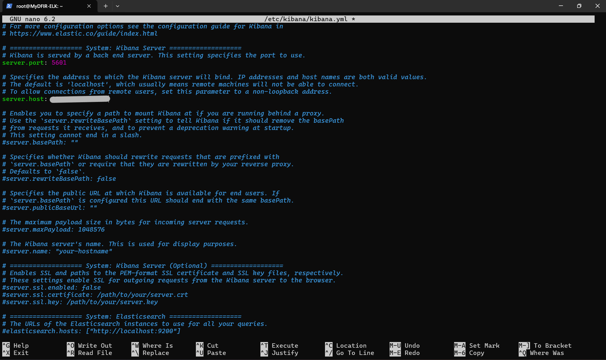
*Ajuste do binding de rede para permitir acesso externo à interface web.*

**Validação do Serviço:**
Após a configuração, o serviço foi iniciado e verificado via SystemD para garantir que não houvesse erros de *bootstrap*.

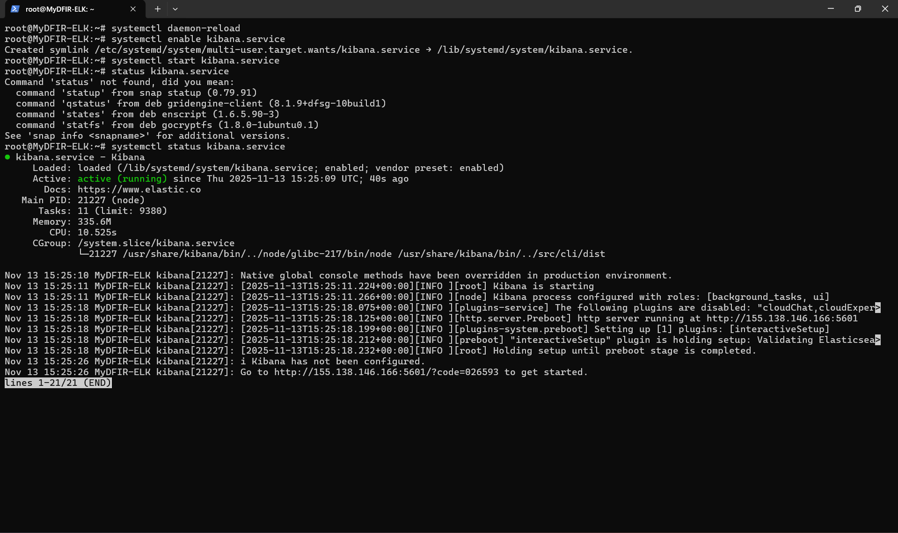
*Serviço do Kibana ativo e rodando (Active/Running).*

### 2. Conexão Segura (Enrollment Token)
Para conectar o Kibana ao Elasticsearch de forma segura, utilizei o mecanismo de **Enrollment Tokens**. Isso garante que a comunicação entre a interface e o banco de dados seja autenticada e criptografada, prevenindo interceptação de dados.

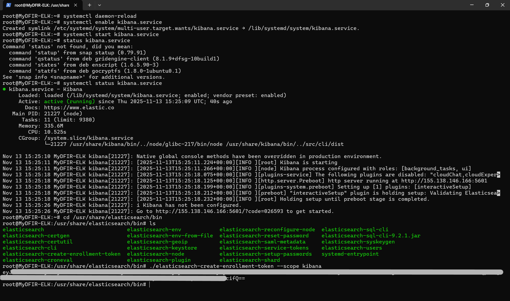
*Geração do token de inscrição para pareamento seguro entre Kibana e Elasticsearch.*

### 3. Acesso e Configuração de Criptografia (Keystore)
Após o login inicial, obtive acesso à interface central do Elastic ("Welcome Home"), confirmando que a stack ELK estava operacional.

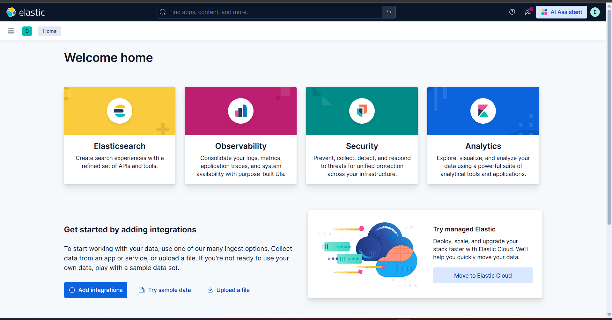
*Acesso bem-sucedido à interface web do Elastic Stack.*

**Troubleshooting: Erro de Permissões e Chaves de Criptografia**
Ao navegar para a aba de **Security > Alerts**, deparei-me com um erro de sistema: *"Detection engine permissions required"*.
Investigando a documentação, identifiquei que o erro não era de permissões de utilizador, mas sim a ausência de chaves de criptografia no *Keystore* do Kibana, necessárias para armazenar regras de alerta de forma segura.

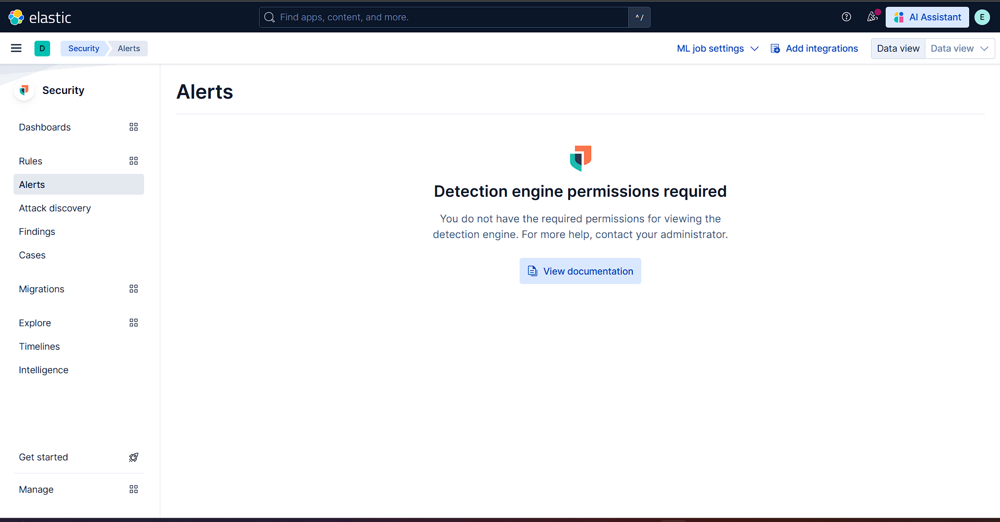
*Erro apresentado devido à falta de chaves de criptografia persistentes.*

**Solução Aplicada:**
1.  Gerei novas chaves de criptografia via CLI (`kibana-encryption-keys generate`).
2.  Adicionei as chaves manualmente ao cofre seguro do Kibana (`kibana-keystore add`).
3.  Reiniciei o serviço para aplicar as alterações.

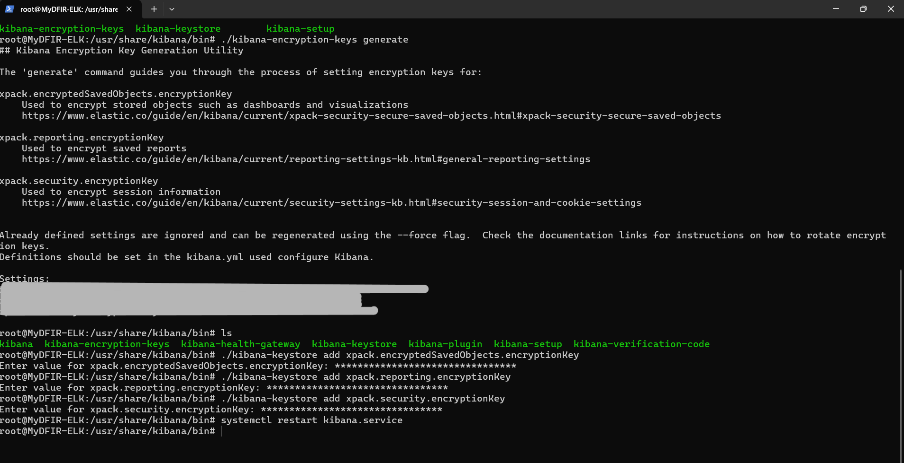
*Geração e inserção das chaves de segurança no Keystore.*

**Resultado Final:**
O painel de Alertas carregou com sucesso, pronto para receber deteções de segurança.

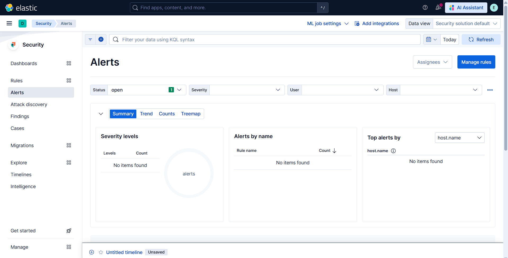
*Painel de Security Alerts totalmente operacional após a correção.*

---

### ⚠️ Desafios e Soluções (Troubleshooting)

**1. Bloqueio de Firewall e Portas Reservadas**
Ao tentar acessar a interface web (`http://IP:5601`), recebi erros de *Connection Timed Out*. Diagnostiquei que o Firewall da Cloud (Vultr) estava bloqueando a porta 5601.
Ao tentar liberar o tráfego TCP, cometi um erro ao definir o range de portas iniciando em `0` (`0-65535`), o que foi rejeitado pela plataforma.

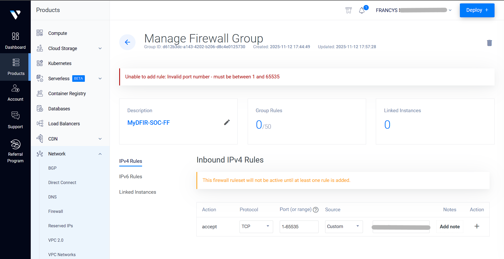
*Erro ao tentar configurar regra de firewall com porta inválida (0).*

* **Solução:** Ajustei a regra para um range válido (`1-65535`) e configurei o acesso temporário para `Anywhere` (0.0.0.0/0) para fins de teste de conectividade, liberando o acesso ao painel do Kibana.

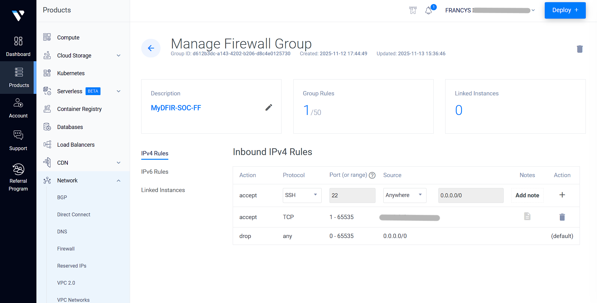
*Regra de firewall corrigida permitindo tráfego TCP na porta do Kibana.*

---

## 📌 Fase 3: Vítima e Hardening 

Para simular um cenário real de ataque, provisionei um servidor Windows Server 2022 exposto à internet. Este servidor atuará como o *endpoint* monitorado e alvo das simulações de ataque.

### 1. Arquitetura de Segurança (Isolamento)
Diferente dos componentes do SIEM (ELK), decidi **não** conectar o servidor Windows à VPC (Rede Privada).
* **Objetivo:** Garantir isolamento total (Network Segmentation). Caso o servidor Windows seja comprometido por um atacante real (o que é esperado, dado que exporemos RDP), o atacante não terá rota de rede lateral para alcançar meu servidor de logs (Ubuntu/Elasticsearch).

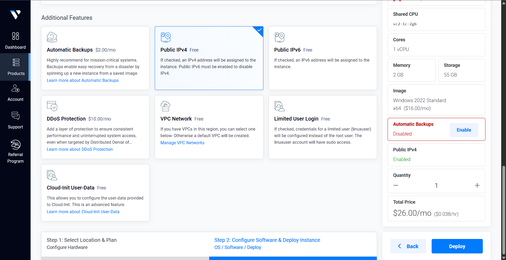
*Provisionamento do Windows Server 2022 fora da VPC para quarentena de rede.*

### 2. Acesso e Configuração Inicial
O acesso inicial foi realizado via Console VNC (NoVNC) provido pela plataforma de nuvem para garantir que o sistema operacional completou o *boot* corretamente antes de expor serviços de rede.

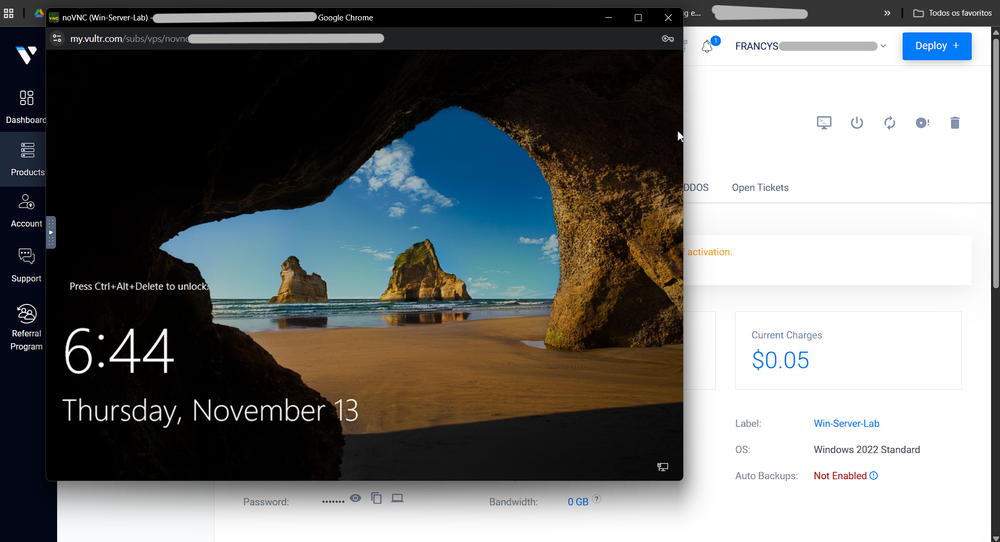
*Boot inicial e login administrativo via Console Web.*

### 3. Exposição Controlada (RDP)
Habilitei o protocolo RDP (Remote Desktop Protocol - Porta 3389) para administração remota.
* **Risco Aceito:** Manter o RDP exposto na internet é uma vulnerabilidade crítica comum. Neste laboratório, isso é intencional para gerar logs de *Brute Force* reais que serão capturados e analisados pelo SIEM nas próximas etapas.

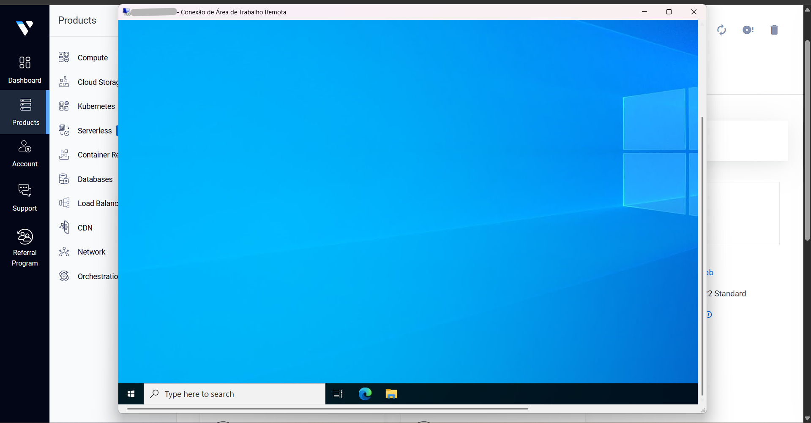
*Conexão remota bem-sucedida provando a acessibilidade pública do alvo.*

---
## 📌 Fase 4: Ingestão de Dados e Fleet Server 

Com a infraestrutura do SIEM (ELK) e da Vítima (Windows) prontas, a próxima etapa foi conectá-los. Para isso, utilizei a arquitetura **Elastic Fleet**, que centraliza o gerenciamento de todos os agentes de coleta.

Esta fase exigiu a criação de uma terceira VM Linux (`MyDFIR-Fleet-Server`) para atuar como o "Gerente" dos agentes, seguindo as boas práticas de separação de funções.

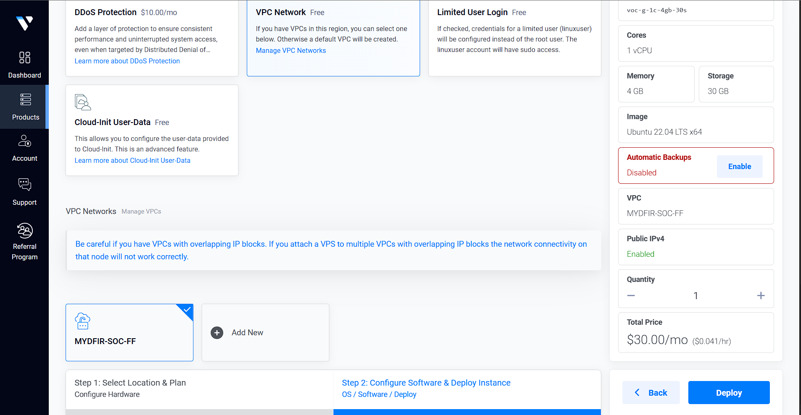
*Provisionamento da VM dedicada para o Fleet Server.*

---

### ⚠️ Desafios e Soluções (Troubleshooting Avançado)

Esta foi a fase mais complexa do projeto até o momento, apresentando múltiplos pontos de falha que exigiram diagnóstico em diferentes camadas (Rede, Aplicação e Configuração).

#### 1. Troubleshooting (Linux): Firewall e Conectividade
Ao tentar instalar o Fleet Server (agente Linux), a instalação falhou com erros de `i/o timeout`.

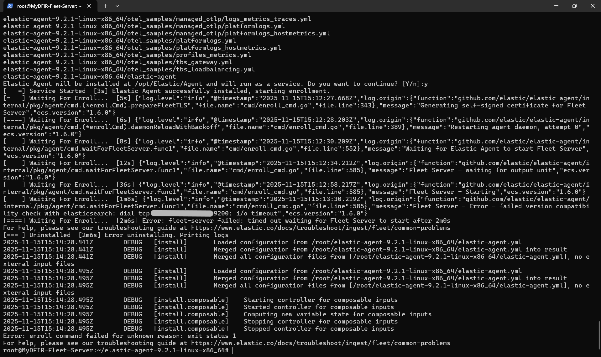
*Log de erro indicando que o Fleet Server não conseguia se comunicar com o Elasticsearch na porta 9200.*

* **Diagnóstico:** O Firewall Group da Vultr, configurado para aceitar conexões apenas do "Meu IP", estava bloqueando a comunicação interna entre os servidores (Fleet não conseguia falar com ELK).
* **Solução:** Alterei a regra de firewall para `Anywhere (0.0.0.0/0)` para o range `1-65535`, permitindo a comunicação interna necessária para o laboratório. Isso resolveu o bloqueio das portas **9200** (Elastic) e **8220** (Fleet).

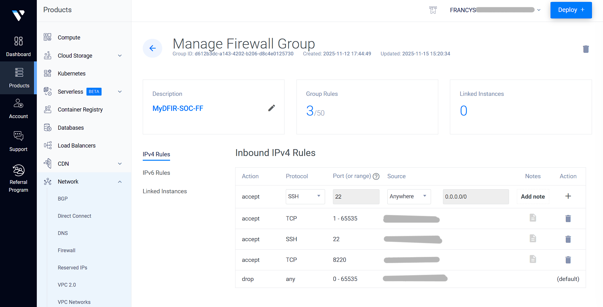
*Ajuste nas regras de firewall para permitir a comunicação interna do lab.*

Após a correção do firewall, a instalação do Fleet Server no Linux foi concluída com sucesso.

*Instalação do agente Fleet Server bem-sucedida.*

#### 2. Troubleshooting (Windows): Instalação do Agente
A implantação do agente no Windows Server apresentou três erros em sequência:
1.  **Erro de PowerShell:** O comando copiado do Kibana era longo e quebrava linhas, fazendo o PowerShell executá-lo incorretamente.
2.  **Erro de Caminho:** O PowerShell não encontrava o `elastic-agent.exe` pois eu não estava no diretório correto.
3.  **Erro de Loop (`:443`):** O agente instalava, mas entrava em loop infinito de conexão.

* **Solução (Comando Final):** Resolvi todos os problemas de uma vez construindo um comando de instalação manual e robusto.
    1.  Naveguei para o diretório correto (`cd elastic-agent...`).
    2.  Usei o IP e a porta **correta** (`:8220`).
    3.  Adicionei a flag `--force` para sobrescrever a instalação anterior falha.

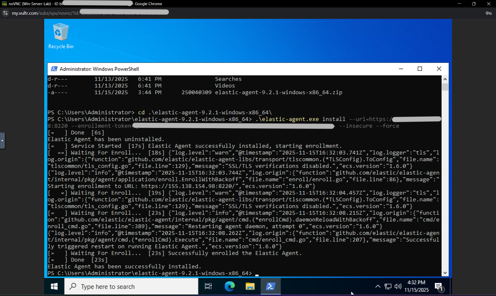
*Comando final no PowerShell (com `cd` e `--force`) que resultou na instalação bem-sucedida.*

#### 3. Troubleshooting (Kibana): O Loop "Updating"
Após a instalação, o agente Windows ficou preso no status "Updating".
* **Diagnóstico:** Ao inspecionar a mensagem de erro no Kibana, notei que o agente tentava se comunicar na porta `:443`, apesar de eu ter forçado a instalação na `:8220`. A **Política de Agente** (Agent Policy) no Kibana estava configurada com a URL errada, sobrescrevendo minha instalação manual.

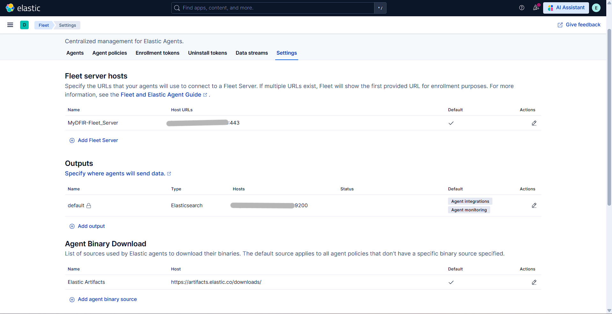
*Configuração do Fleet Server no Kibana apontando para a porta errada (443).*

* **Solução Definitiva:** Editei as configurações do Fleet Server diretamente no Kibana, corrigindo a URL global para `https://[IP_DO_FLEET]:8220`. Após reiniciar o serviço no Windows (`Stop-Service/Start-Service`), o agente recebeu a política correta.

### 4. Validação Final da Infraestrutura
Com todas as correções aplicadas, ambos os agentes (Linux Fleet Server e Windows Vítima) reportaram status **Healthy** (Saudável), confirmando que a infraestrutura de coleta de logs está 100% operacional.

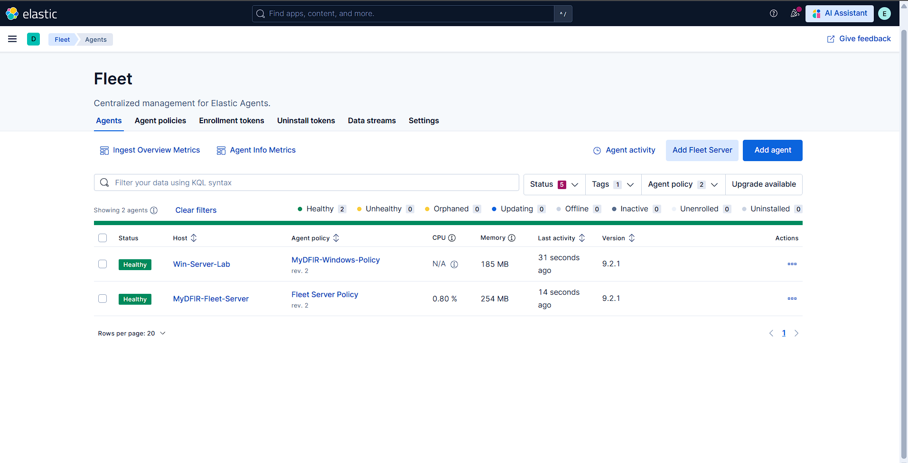
*Visão final do painel Fleet com todos os agentes online e saudáveis.*

---
## 📌 Fase 5: Enriquecimento de Logs com Sysmon 

Com os agentes online, o próximo passo foi enriquecer a qualidade dos dados coletados. O Elastic Agent coleta os logs de segurança padrão do Windows, mas para uma detecção de ameaças eficaz (Threat Hunting), é necessária uma telemetria mais profunda.

Para isso, instalei o **Sysmon (System Monitor)** da Microsoft, a ferramenta padrão da indústria para monitoramento avançado de *endpoints*.

### 1. Instalação e Configuração
A instalação foi realizada no servidor Windows Server (Vítima). O ponto crucial foi não instalar o Sysmon com as configurações padrão (que são muito "barulhentas").

Utilizei uma configuração personalizada (`.xml`) baseada no projeto *SwiftOnSecurity*, que é um padrão de mercado. Este arquivo filtra eventos de sistema irrelevantes e foca no que é importante para a segurança, otimizando a ingestão de dados no SIEM.

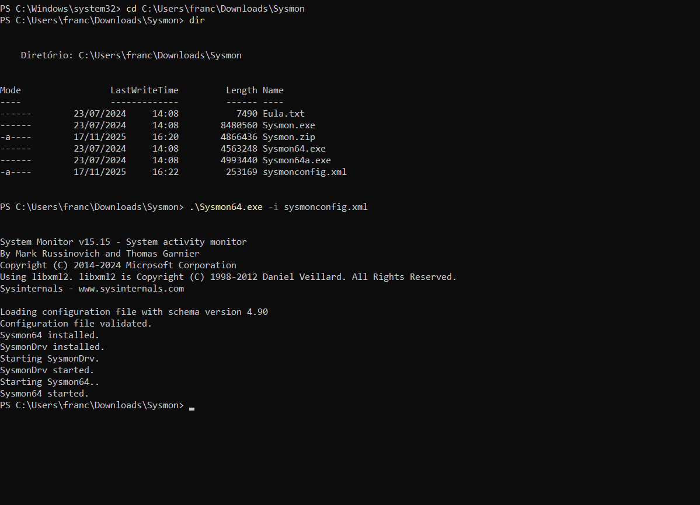
*Instalação do Sysmon via PowerShell (Admin), aplicando o arquivo de configuração .xml.*

### 2. Validação Local
Após a instalação, validei que o Sysmon estava operacional na própria máquina antes de tentar configurá-lo no SIEM.

**1. Verificação do Serviço:**
Confirmei que o serviço `Sysmon64` foi instalado e estava em execução (`Running`) no `services.msc`.

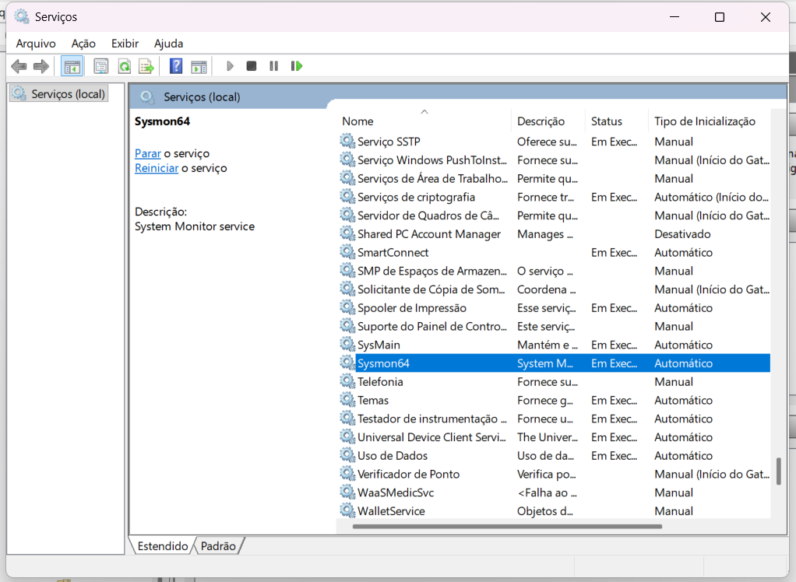
*Serviço Sysmon64 ativo e rodando em segundo plano.*

**2. Verificação dos Logs:**
Confirmei no **Visualizador de Eventos (Event Viewer)** que os logs estavam sendo gerados. Isso prova que o Sysmon está monitorando ativamente o sistema.

*Logs operacionais do Sysmon (ex: Event ID 3 - Network connection) sendo gerados localmente.*

---
## 📌 Fase 6: Ingestão de Logs no SIEM 

Com o Sysmon a gerar logs localmente, o passo final da infraestrutura foi configurar o *Elastic Agent* para ler esses arquivos e enviá-los para o Elasticsearch.

### 1. Integração de Fontes de Dados (Data Ingestion)
No Kibana, configurei a política do agente Windows para incluir duas novas integrações de **"Custom Windows Event Logs"**. Isso instrui o agente a ler canais específicos do Windows Event Viewer.

**Canais Configurados:**
* **Sysmon:** `Microsoft-Windows-Sysmon/Operational` (Foco em criação de processos e rede).
* **Windows Defender:** `Microsoft-Windows-Windows Defender/Operational` (Foco em deteção de malware).

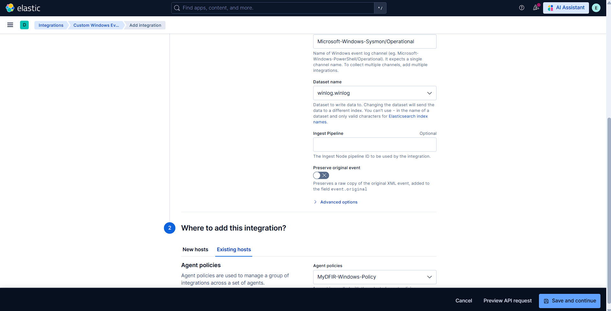
*Configuração do canal de ingestão para logs do Sysmon.*

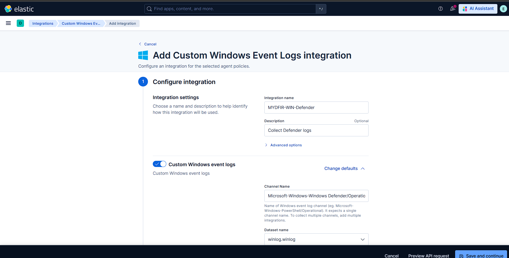
*Configuração do canal de ingestão para logs do Windows Defender.*

### 2. Validação de Recebimento (Data Discovery)
Após aplicar a política, aguardei a propagação para o agente e validei o recebimento dos dados na aba **Discover** do Kibana.

Realizei testes gerando atividade no servidor (como reiniciar serviços de segurança) para confirmar que os logs estavam a chegar quase em tempo real.

**Resultado:**
Os logs do Sysmon (ex: *Process Create*, Event ID 1) e do Defender começaram a ser indexados corretamente pelo SIEM.

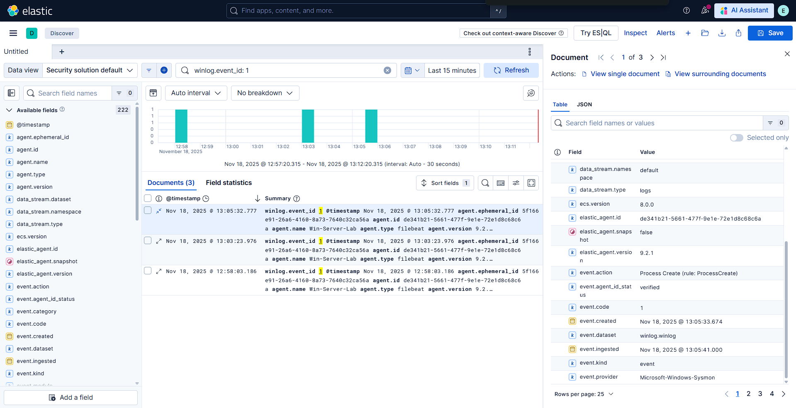
*Prova de ingestão: Log detalhado do Sysmon visualizado no Kibana.*

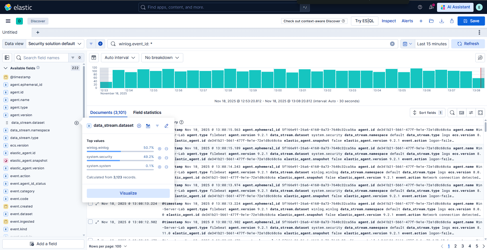
*Gráfico de volume de eventos confirmando o fluxo contínuo de dados entre a Vítima e o SIEM.*

---
## 📌 Fase 7: Criação de Honeypot SSH e Análise de Ataques 

O objetivo desta fase era provisionar um servidor Linux exposto à internet para atuar como "isca" (Honeypot) e capturar tentativas reais de ataque SSH (Brute Force).

### 1. Otimização de Recursos (Engenharia)
Durante o provisionamento de uma quarta instância (Linux Target), atingi o limite de cota da conta de nuvem (Cloud Resource Quotas).

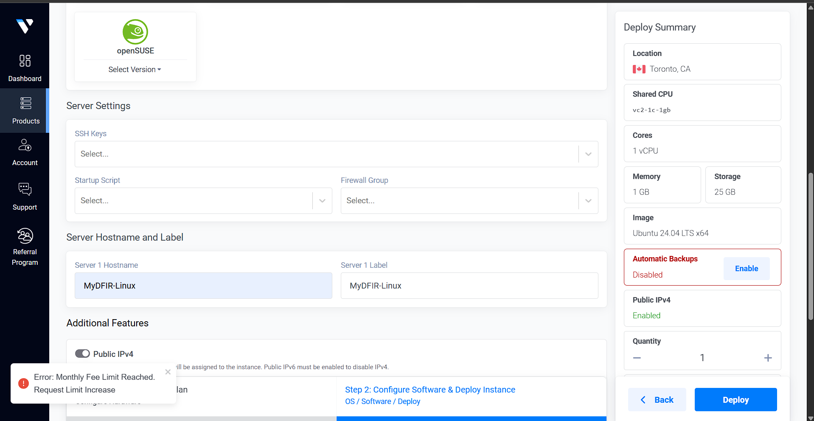
*Limite de instâncias atingido durante a tentativa de scale-out.*

* **Solução Arquitetural:** Em vez de solicitar aumento de cota (o que geraria custos), optei por reutilizar o servidor `MyDFIR-Fleet-Server`. Como ele já é um servidor Linux Ubuntu exposto à internet (necessário para os agentes remotos), ele serve perfeitamente como alvo duplo: **Gerenciador de Agentes** e **Honeypot SSH**.

### 2. Análise de Logs de Autenticação (`auth.log`)
Acessando o servidor via SSH, analisei os logs de autenticação localizados em `/var/log/auth.log`.
Em pouco mais de 24 horas de exposição à internet, o servidor registrou centenas de tentativas de acesso não autorizado vindas de múltiplos endereços IP globais.

**Evidências de Ataque:**
Os logs mostram bots tentando adivinhar senhas para usuários comuns (`root`, `admin`) e serviços específicos (`git`, `composer`, `squid`).

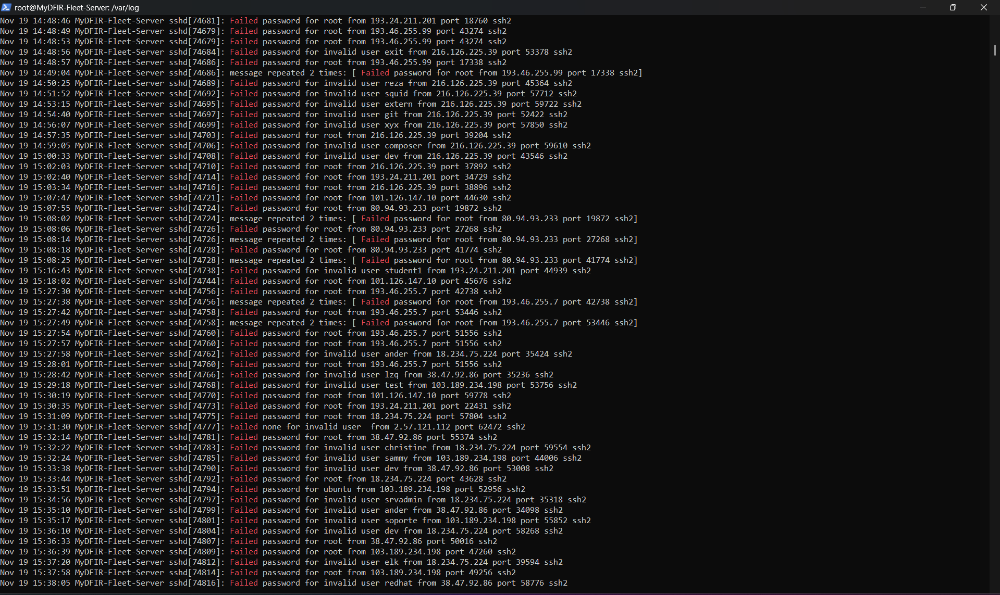
*Live logs demonstrando tentativas massivas de Brute Force contra o servidor exposto.*

---
## 📌 Fase 8: Ingestão de Logs Linux e Monitoramento SSH 

Com o servidor Linux ("Honeypot") sob ataque constante, configurei o agente para coletar esses logs e enviá-los para o SIEM, permitindo análise centralizada.

### 1. Configuração da Integração de Sistema
Como o *Fleet Server* já possuía o Elastic Agent instalado, precisei apenas validar a política de agentes. Confirmei que a integração **System** estava ativa e configurada para ler os logs de autenticação do sistema operacional.

* **Caminho do Log:** `/var/log/auth.log` (Padrão Ubuntu/Debian).
* **Dataset:** `system.auth`.

*Configuração da política para coleta de logs de autenticação (auth.log).*

### 2. Visualização de Ataques em Tempo Real
No Kibana, utilizei a funcionalidade **Discover** para filtrar eventos do dataset `system.auth` com resultado de falha (`event.outcome: failure`).

**Resultado:**
Os ataques de força bruta que antes eram apenas linhas de texto no terminal agora são eventos estruturados no SIEM. O gráfico de volume mostra a persistência dos ataques ao longo do tempo.

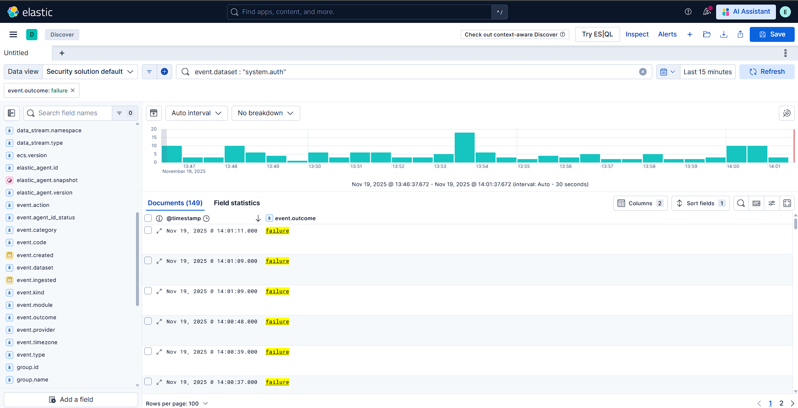
*Visualização no Kibana confirmando a ingestão contínua de falhas de login SSH vindas da internet.*

---
## 📌 Fase 9: Criação de Alertas e Dashboards 

Com os dados de ataque fluindo para o SIEM, o objetivo final era transformar logs brutos em inteligência acionável. Criei mecanismos de detecção automática e visualização geográfica.

### 1. Regra de Detecção (Alerting)
Criei uma regra de alerta para detectar padrões de força bruta (Brute Force).
* **Lógica:** Se um único host gerar mais de **5 falhas de autenticação SSH** (`system.auth.ssh.event: Failed`) em um intervalo de **5 minutos**, um alerta de severidade média é disparado.

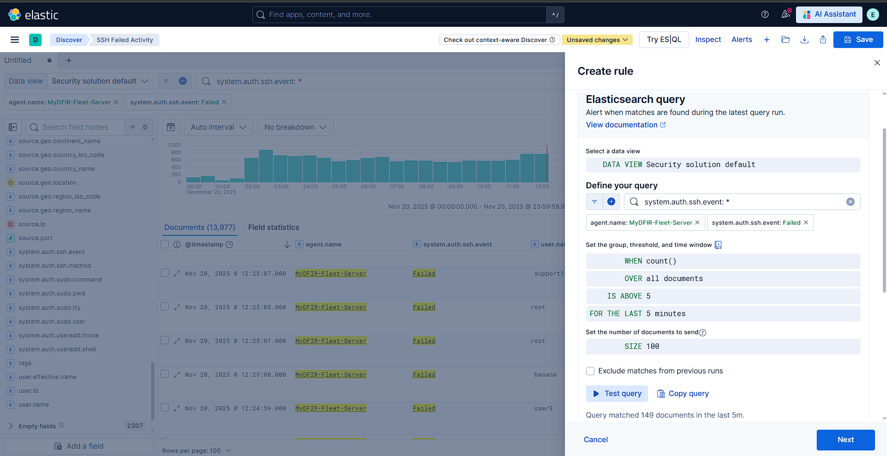
*Configuração da regra de threshold para detecção de força bruta SSH.*

### 2. Construção de Dashboards (Threat Intelligence)
Para visualizar a origem dos ataques, utilizei o **Elastic Maps**.
Configurei uma camada (*Layer*) baseada no campo `source.geo.country_iso_code`, que traduz o IP do atacante em sua localização geográfica.

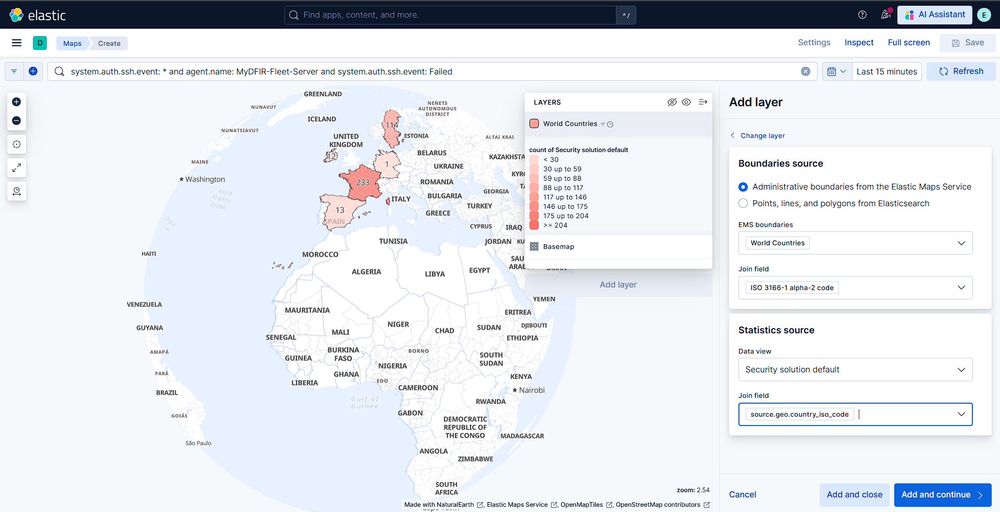
*Mapeamento de IPs para geolocalização usando códigos ISO de países.*

### 3. Resultado Final: O Mapa de Ameaças
O Dashboard final apresenta uma visão em tempo real da cibersegurança do servidor. Em poucas horas de monitoramento, foi possível identificar ataques distribuídos vindos da Europa e Ásia (França, Indonésia, Itália), confirmando a natureza global das ameaças automatizadas.

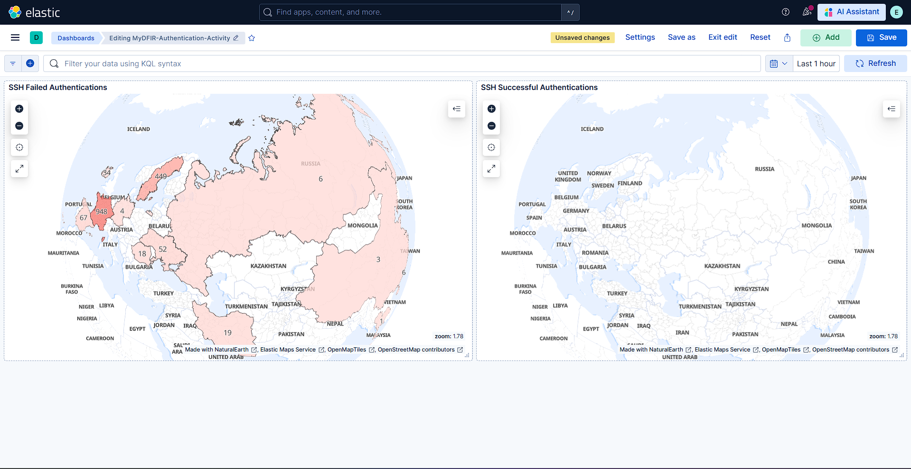
*Dashboard de Threat Hunting visualizando a origem global dos ataques SSH.*

---
## 📌 Fase 10: Engenharia de Detecção e SIEM 

Com a ingestão de dados validada, avancei para a criação de regras de detecção (Detection Engineering) utilizando o módulo **Elastic Security**. Diferente dos alertas simples, estas regras utilizam lógica de correlação e *thresholds* (limiares) para identificar comportamentos anômalos.

### 1. Análise de Padrões de Ataque RDP
Antes de criar a regra, analisei os logs brutos do Windows no Discover. Identifiquei que falhas de login geram o **Event ID 4625** (*An account failed to log on*). Este ID é a base para detectar tentativas de acesso não autorizado.

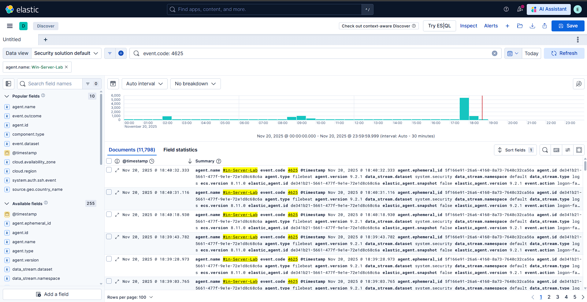
*Identificação de logs de falha de autenticação Windows (Event ID 4625) para basear a regra de detecção.*

### 2. Criação de Regras de Detecção (Threshold Rules)
Criei duas regras distintas no SIEM, uma para cada sistema operacional, garantindo precisão e evitando falsos positivos.

**Regra 1: SSH Brute Force (Linux)**
* **Alvo:** `MyDFIR-Fleet-Server`
* **Query:** `system.auth.ssh.event: *` (Eventos de autenticação SSH).
* **Lógica:** Dispara se houver **5 ou mais** tentativas de falha vindas do mesmo IP para o mesmo usuário em 5 minutos.

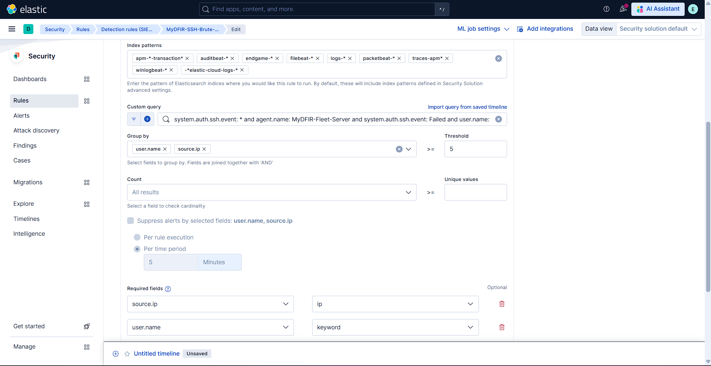
*Configuração da regra de threshold para Linux, agrupando eventos por IP de origem e usuário.*

**Regra 2: RDP Brute Force (Windows)**
* **Alvo:** `Win-Server-Lab`
* **Query:** `event.code: 4625` (Logon Failure).
* **Lógica:** Similar à do Linux, detecta volume alto de erros de senha via RDP.

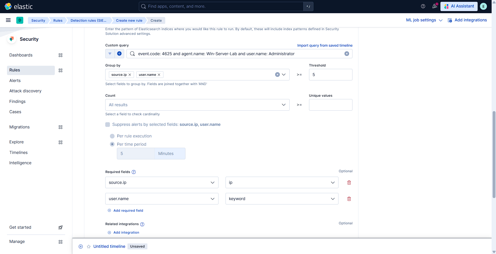
*Configuração da regra de threshold para Windows, focada no Event ID 4625.*

### 3. Status do Monitoramento
As regras foram ativadas e estão monitorando em tempo real. Qualquer atividade que ultrapasse os limiares definidos gerará automaticamente um "Alerta de Segurança" no painel do analista.

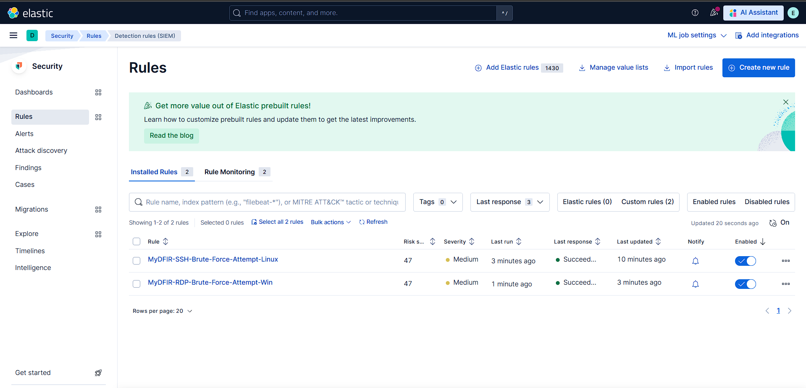
*Painel de Detection Rules com as regras de Linux e Windows implementadas e ativas.*

---
## 📌 Fase 11: Visualização de Ameaças RDP e Dashboard Unificado 

Para complementar a visibilidade, expandi o Dashboard para incluir as tentativas de ataque ao servidor Windows (RDP). O objetivo final foi criar um "Painel de Controle" (Single Pane of Glass) que unificasse a visão de ameaças de toda a infraestrutura.

### 1. Mapeamento de Ataques Windows
Configurei um novo mapa no Kibana filtrando especificamente pelo **Event ID 4625** (Falha de Login RDP). Isso permite visualizar geograficamente de onde vêm as tentativas de invasão ao servidor Windows, separando-as visualmente dos ataques SSH.

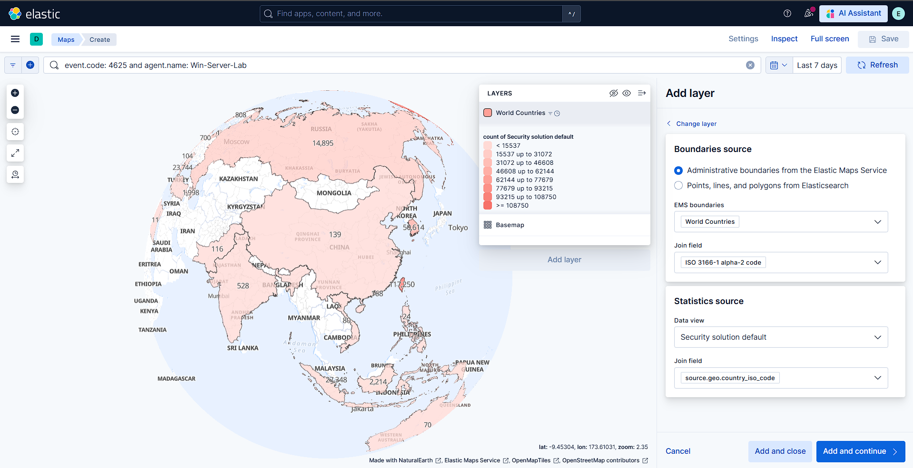
*Camada de mapa configurada para plotar tentativas de acesso RDP por geolocalização.*

### 2. Análise Tabular (Top Offenders)
Além do mapa, criei visualizações em tabela para identificar os principais ofensores.
As tabelas agregam dados por:
* **User Name:** Quais usuários estão sendo mais testados (ex: `Administrator`, `root`, `admin`).
* **Source IP:** Quais endereços IP estão gerando mais volume de ataque.
* **País de Origem:** Visão consolidada por nação.

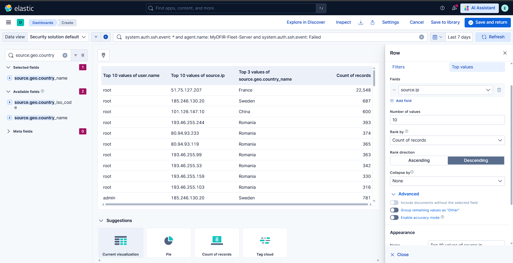
*Tabela dinâmica classificando os top 10 IPs e usuários utilizados nas tentativas de força bruta.*

### 3. Dashboard Unificado de Ameaças
Consolidei todas as visualizações em um único Dashboard Operacional, totalizando 8 painéis de visualização divididos por sistema operacional:

* **Seção Superior (Linux/SSH):** Mapas de geolocalização e tabelas de origem de ataques ao Fleet Server.
* **Seção Inferior (Windows/RDP):** Mapas e tabelas focados nas tentativas de intrusão ao servidor Windows.

Esta organização permite uma leitura vertical rápida e correlacionada de toda a superfície de ataque.

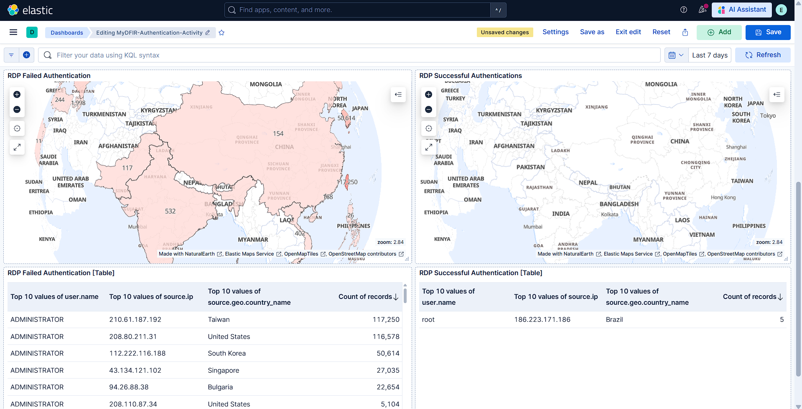
*Visão geral do Dashboard de Segurança no Kibana.*

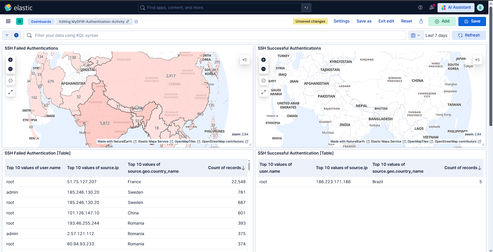
*Visão detalhada (Full Page) incluindo as tabelas de "Top Offenders" para ambos os protocolos.*

---
## 📌 Fase 12: Planejamento de Ataque e C2 

Antes de executar a simulação de adversário, desenhei o fluxo de ataque (Kill Chain) para garantir que todos os estágios gerem telemetria detectável pelo SIEM. O plano segue a estrutura do framework MITRE ATT&CK.

**O Plano de Ataque:**

**Parte 1: Acesso e Reconhecimento**
1.  **Initial Access:** Força bruta via RDP para ganhar acesso ao servidor.
2.  **Discovery:** Execução de comandos de descoberta (`whoami`, `ipconfig`, `net user`) para mapear o ambiente.
3.  **Defense Evasion:** Desabilitação manual do Windows Defender para permitir a execução do malware.

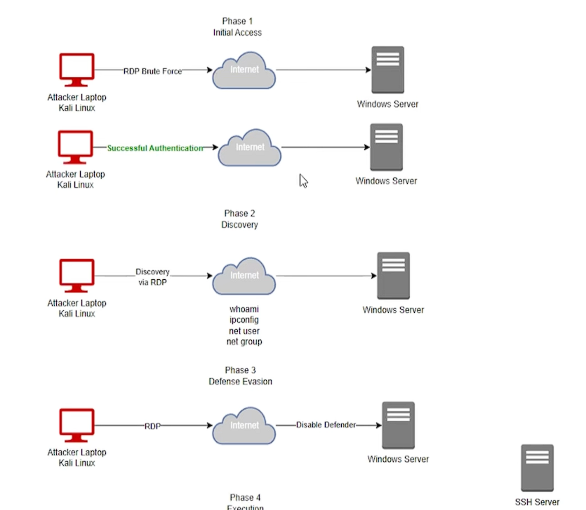
*Fases iniciais do ataque planejado: Acesso, Descoberta e Evasão.*

**Parte 2: Comando e Controle**
4.  **Execution:** Download e execução do agente malicioso via PowerShell.
5.  **Command & Control (C2):** Estabelecimento de comunicação persistente com o servidor Mythic C2.
6.  **Exfiltration:** Simulação de roubo de dados (arquivo `passwords.txt`).

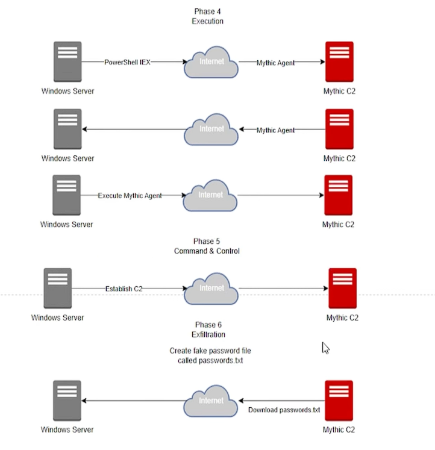
*Fases finais do ataque: Execução de C2 e Exfiltração de dados.*

---
## 📌 Fase 13: Infraestrutura de Comando e Controle (C2) 

Para executar o ataque planejado, precisei de uma infraestrutura de **C2 (Command & Control)**. A ferramenta escolhida foi o **Mythic**, um framework C2 moderno, multi-usuário e baseado em Docker, amplamente utilizado em operações de Red Team.

### 1. Instalação do Servidor C2
Devido às restrições de cota na nuvem, realizei a instalação do Mythic no servidor `MyDFIR-Fleet-Server`, aproveitando os recursos disponíveis (4GB RAM) para rodar os containers Docker necessários.

* **Deploy:** Instalação de dependências (Docker Compose) e compilação dos serviços via `make`.
* **Rede:** Configuração de regra de Firewall para expor a porta administrativa `7443`.

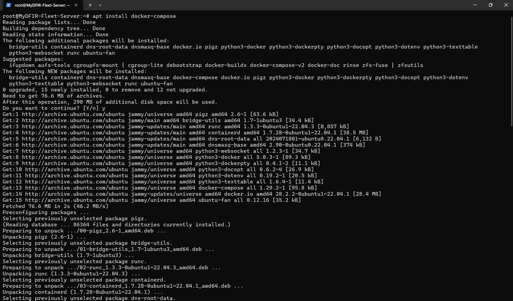
*Preparação do ambiente e instalação do Docker Compose.*

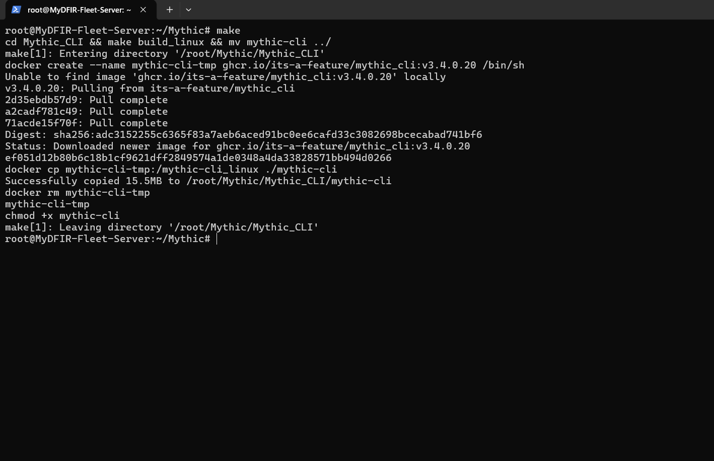
*Compilação dos containers do framework Mythic.*

### 2. Configuração e Acesso
Após o build, recuperei as credenciais de administração geradas no arquivo de ambiente (`.env`) e validei o acesso ao painel de operações.

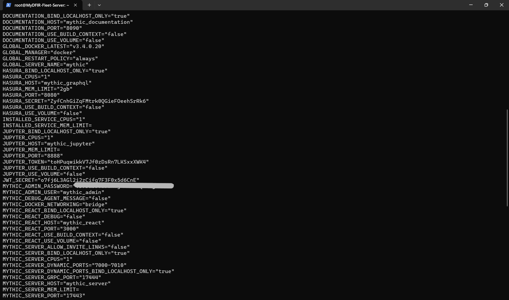
*Recuperação segura das credenciais de acesso administrativo.*

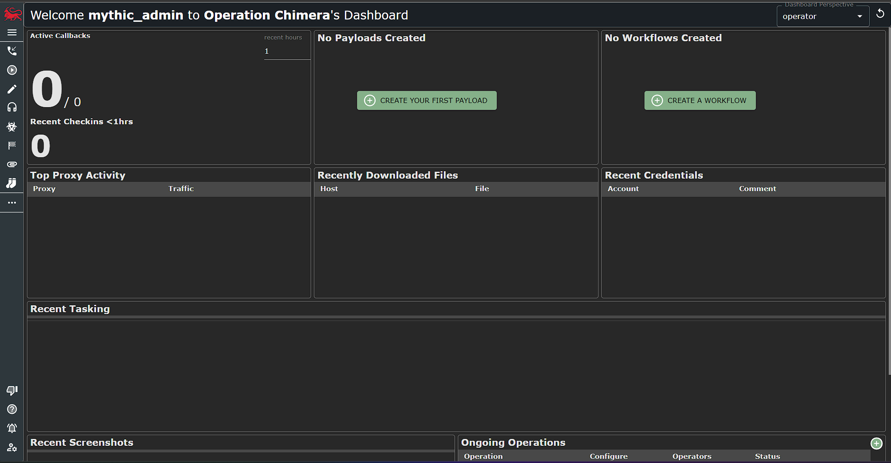
*Painel de Operações do Mythic C2 online e pronto para gerenciar agentes.*

### 3. Máquina de Ataque (Kali Linux)
Paralelamente, configurei uma máquina virtual local com **Kali Linux** utilizando VirtualBox. Esta máquina servirá como o ponto de lançamento dos ataques manuais e geração de payloads, conectando-se ao C2 na nuvem.

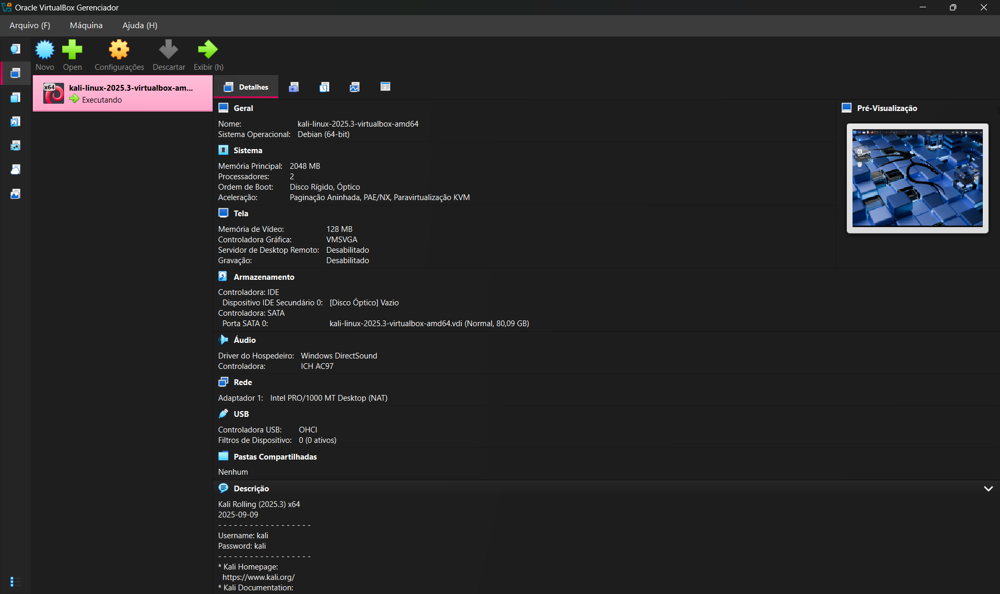
*Virtualização local do Kali Linux para operações ofensivas.*

---
## 📌 Fase 14: Execução de Ataque - Weaponization e Initial Access 

Nesta fase crítica, executei o ciclo completo de ataque (Kill Chain), desde a preparação do artefato malicioso até o acesso inicial via força bruta.

### 1. Weaponization (Criação do Payload)
Utilizei o servidor Mythic C2 para gerar um agente malicioso (**Apollo**) configurado para sistemas Windows.
* **Perfil:** HTTP (comunicação via porta 80/443 simulada).
* **Formato:** Executável Windows (`svchost.exe`) para evadir detecção simples por nome.

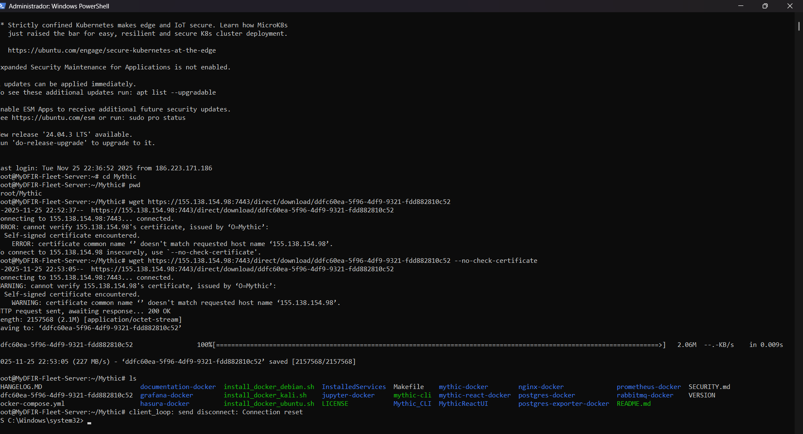
*Instalação do agente Apollo no servidor C2.*

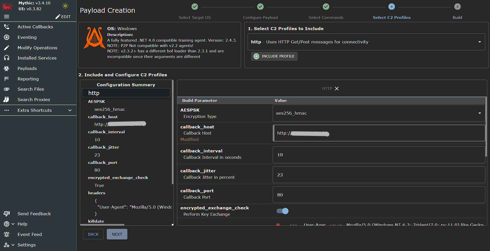
*Configuração do payload HTTP para comunicação persistente com o C2.*

### 2. Initial Access (Ataque de Força Bruta)
Para entregar o payload, precisei primeiro ganhar acesso ao servidor. Utilizei o **Kali Linux** para executar um ataque de dicionário contra o serviço RDP.

**Ferramentas:** `Hydra` e `xFreeRDP`.
**Técnica:** T1110 (Brute Force).

Após ajustar as configurações de NLA (Network Level Authentication) no alvo para permitir conexões legadas, o Hydra recuperou com sucesso a senha de Administrador.

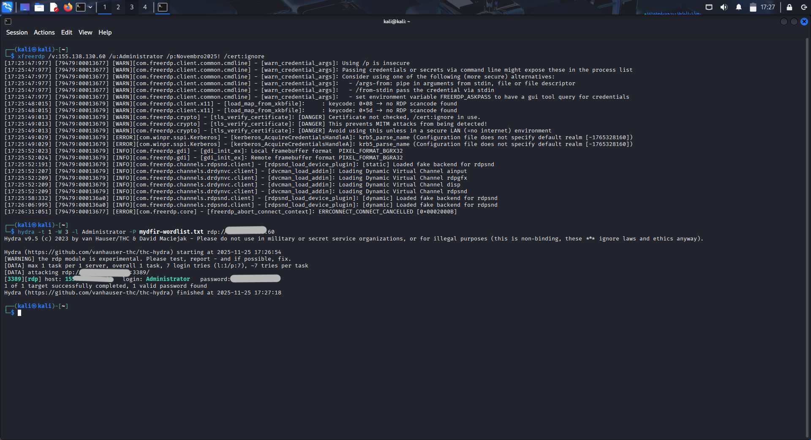
*Execução bem-sucedida do Hydra recuperando credenciais de acesso.*

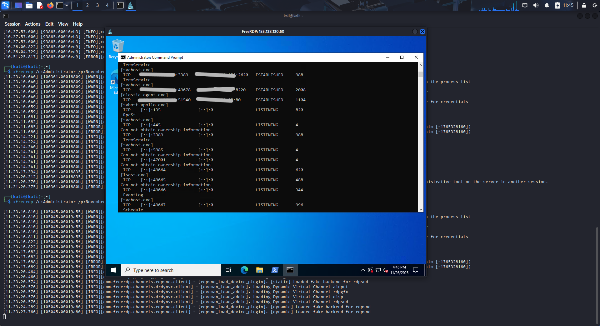
*Acesso RDP obtido via Kali Linux utilizando as credenciais comprometidas.*

### 3. Command & Control (Callback)
Com acesso ao servidor, transferi e executei o payload. O agente Apollo estabeleceu conexão imediata com o servidor Mythic, concedendo controle remoto total sobre a vítima.

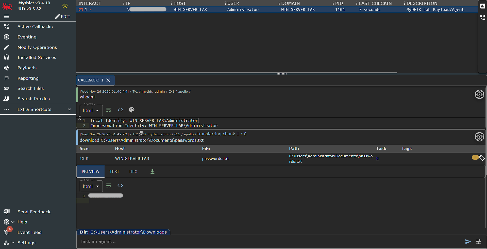
*Sessão ativa no Mythic C2, confirmando o comprometimento total do servidor Windows.*

### ⚠️ Desafios e Soluções (Troubleshooting Ofensivo)

Durante a execução do ataque, enfrentei mecanismos de defesa nativos do Windows e problemas de conectividade que exigiram adaptação das táticas.

#### 1. Bloqueio de Conexão RDP (NLA)
Ao tentar executar o Hydra, recebi erros de `[ERROR] freerdp: The connection failed to establish`, mesmo com o servidor online.
* **Diagnóstico:** O alvo estava configurado com **NLA (Network Level Authentication)** ativo, que rejeita conexões de ferramentas de força bruta legadas antes mesmo da tentativa de senha.
* **Solução:** Desativei o NLA no servidor alvo via GUI e garanti a alteração via registro do Windows para permitir a negociação de credenciais pelo Hydra.

#### 2. Falhas no Brute Force (Rate Limiting)
Mesmo com a senha correta na wordlist, o Hydra falhava em identificar o sucesso ou perdia a conexão.
* **Diagnóstico:** O envio padrão de múltiplas threads paralelas sobrecarregava o serviço RDP, causando negação de serviço temporária ou bloqueio.
* **Solução:** Ajustei os parâmetros do ataque para ser mais lento e sequencial (`-t 1` para uma task por vez e `-W 3` para espera entre tentativas), garantindo estabilidade na conexão.

#### 3. Execução do Payload (Caminhos e Sintaxe)
Tive dificuldades ao executar o payload via PowerShell devido a erros de *Path* e sintaxe de comandos de download (`Invoke-WebRequest`).
* **Solução:** Optei pelo download direto via navegador para garantir a integridade do arquivo e executei o artefato malicioso (`svchost.exe`) navegando manualmente até o diretório de usuário, contornando erros de caminho relativo.
---
## 🚨 Incidente Real: Cloud Abuse Report & Remediação

Durante a execução da simulação de C2 (Mythic), a infraestrutura do laboratório foi detectada por scanners de Threat Intelligence externos (Spamhaus), gerando um reporte de abuso real junto ao provedor de nuvem (Vultr).

**O Evento:**
* **Detecção:** Atividade de "Botnet C2" na porta 7443/80.
* **Causa Raiz:** Falha de OPSEC (Operational Security). As regras de firewall foram configuradas como `Anywhere (0.0.0.0/0)` para facilitar a conectividade do laboratório, expondo a assinatura do C2 à internet pública.

**Ação de Resposta (Containment & Eradication):**
1.  **Isolamento:** O servidor comprometido/ofensor (`MyDFIR-Fleet-Server`) foi imediatamente destruído para cessar a exposição.
2.  **Comunicação:** Resposta formal ao time de Trust & Safety do provedor, detalhando o contexto educacional e as medidas de correção tomadas.
3.  **Lições Aprendidas:** Em implementações futuras de C2, o acesso deve ser estritamente restrito via *Allowlisting* de IPs (apenas meu IP residencial) ou via VPN, nunca exposto publicamente.
---
## 📌 Fase 15: Implementação de Sistema de Ticketing 

Após o incidente de segurança simulado (e o real com a nuvem), ficou clara a necessidade de uma plataforma para gerenciar, triar e documentar os incidentes de forma organizada.

Para isso, implementei o **osTicket**, um sistema de Help Desk open-source amplamente utilizado para gestão de chamados em TI e Segurança.

### 1. Provisionamento e Hardening
Criei um novo servidor Windows Server 2022 para hospedar a aplicação web (PHP/MySQL).
Aplicando as lições de OPSEC aprendidas anteriormente, implementei uma política de firewall restritiva desde o início:
* **Porta 80 (HTTP):** Acesso permitido *apenas* para meu endereço IP de gerenciamento.
* **Porta 3389 (RDP):** Acesso restrito ao meu IP.

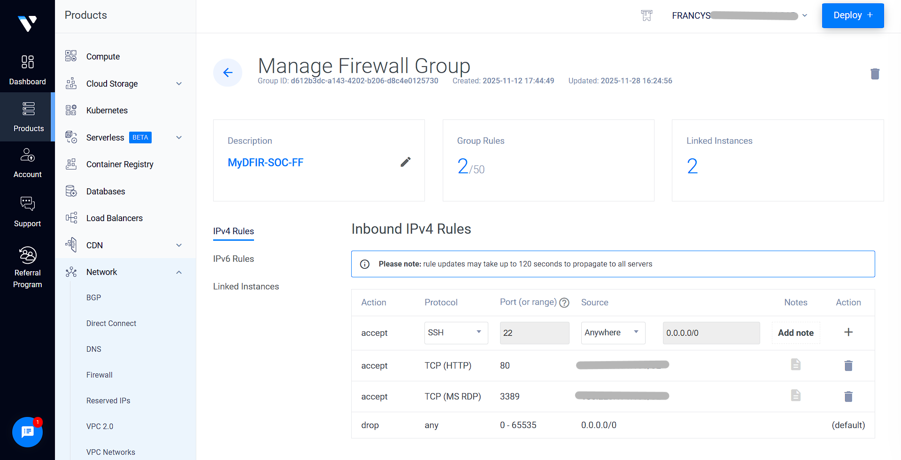
*Regras de firewall configuradas com Allowlisting estrito para prevenir exposição pública indesejada.*

### 2. Instalação da Stack Web (WAMP)
Configurei o ambiente de servidor web utilizando o pacote XAMPP (Apache, MySQL, PHP) e realizei o deploy da aplicação osTicket, criando o banco de dados e definindo as credenciais administrativas.

### 3. Validação do Sistema
O sistema está operacional e pronto para receber integrações via API. A partir de agora, os alertas gerados no ELK (como o Brute Force RDP) poderão ser transformados automaticamente em tickets para investigação formal.

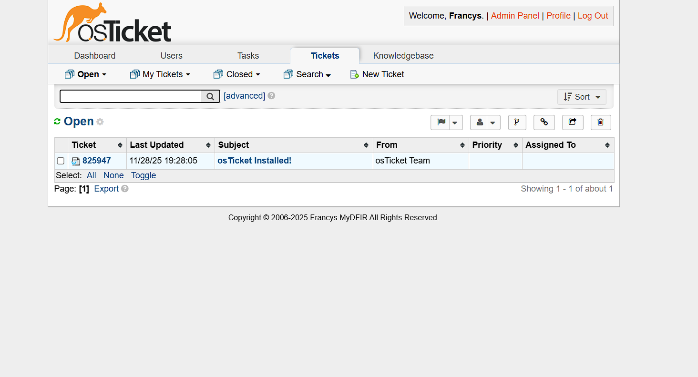
*Painel administrativo do osTicket funcional e pronto para operação.*

### ⚠️ Desafios e Soluções (Troubleshooting de Infraestrutura)

Durante o deploy do servidor de gestão, enfrentei desafios relacionados com performance e segurança de rede.

#### 1. Gargalo de Recursos (Resource Contention)
Ao instalar a stack WAMP (XAMPP) no Windows Server, o sistema tornou-se não responsivo, travando a sessão RDP e o cursor do rato.
* **Diagnóstico:** A instância selecionada (1 vCPU / 2GB RAM) atingiu 100% de uso de CPU ao tentar processar a descompactação do instalador simultaneamente com o scan em tempo real do Windows Defender.
* **Solução:** Apliquei técnicas de gestão de sessão (reconexão RDP para limpar o buffer de vídeo) e aguardei a finalização dos processos de I/O intensivos, evitando reinícios forçados que poderiam corromper a instalação do banco de dados.

#### 2. Correção de Vulnerabilidade de Firewall
Identifiquei que o Firewall Group herdado dos laboratórios anteriores possuía uma regra residual de "Allow All" (`0.0.0.0/0` em todas as portas TCP), o que gerou o incidente de abuso anterior.
* **Solução (Hardening):** Realizei uma auditoria nas regras e removi as permissões genéricas. Configurei o acesso às portas administrativas (3389 e 80) estritamente para o meu endereço IP (`My IP/32`), garantindo que o painel de gestão do osTicket não fique exposto a scanners públicos.

#### 3. Erro de Permissão MySQL e Reversão de Configuração
Ao alterar o *host* do banco de dados para o IP Público no arquivo `config.inc.php`, perdi o acesso ao PHPMyAdmin com o erro *"Host is not allowed to connect"*.
* **Diagnóstico:** O usuário `root` do banco de dados estava configurado para aceitar conexões apenas de `localhost`. Ao mudar a configuração do arquivo antes de alterar as permissões do usuário, quebrei a conectividade.
* **Solução:** Reverti a configuração para o padrão (usando o backup ou edição manual), acessei o painel localmente, concedi permissões explícitas para o meu IP Público nos usuários do banco e, somente então, reapliquei a configuração de rede externa..
---
## 📌 Fase 16: Automação de Resposta a Incidentes - SOAR 

Com o sistema de gestão operacional (osTicket) no ar, o objetivo final foi criar uma automação **SOAR (Security Orchestration, Automation, and Response)**. Configurei o ELK Stack para se comunicar automaticamente com o osTicket via API, fechando o ciclo de detecção e resposta.

### 1. Configuração da API e Conector
* **No osTicket:** Criei uma API Key vinculada estritamente ao IP do servidor ELK (`155.138...`), autorizando apenas este servidor a abrir chamados.
* **No Kibana:** Configurei um conector do tipo **Webhook**. Como o osTicket exige autenticação via cabeçalho, utilizei a funcionalidade de *Custom HTTP Headers* para injetar a chave `X-API-Key` nas requisições.

*Configuração de segurança da API Key, limitando o acesso ao IP de origem do SIEM.*

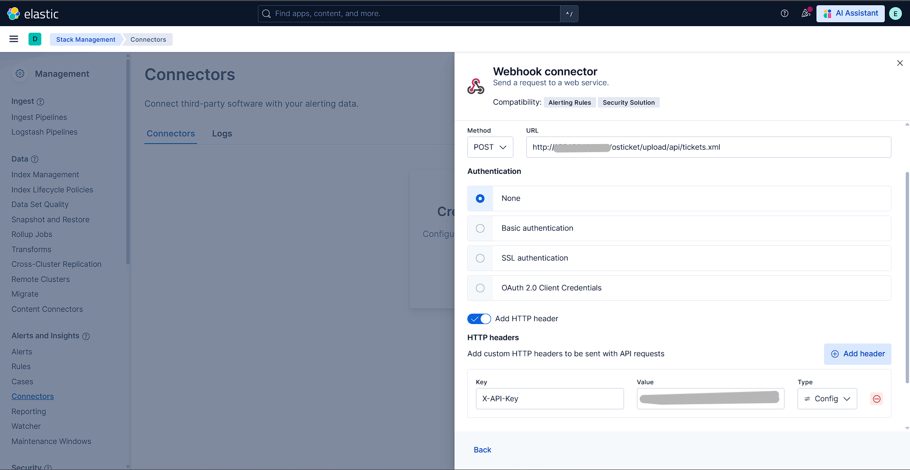
*Configuração do conector Webhook utilizando autenticação via Custom Header.*

### 2. Definição do Payload
Configurei o corpo da requisição (Payload) em formato XML, mapeando os campos do alerta do Elastic para os campos do ticket (Assunto, Mensagem, Prioridade).

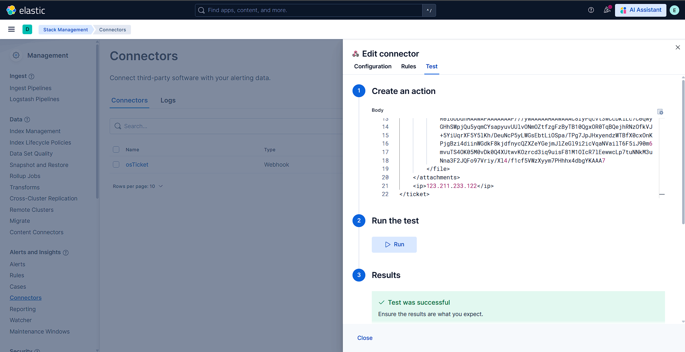
*Estrutura XML definida para a criação automática do ticket.*

### 3. Validação da Automação
Realizei testes de conectividade enviando dados simulados.
* **Resultado:** O conector obteve resposta `201 Created`, e o ticket apareceu instantaneamente no painel de suporte, validando a integração end-to-end.

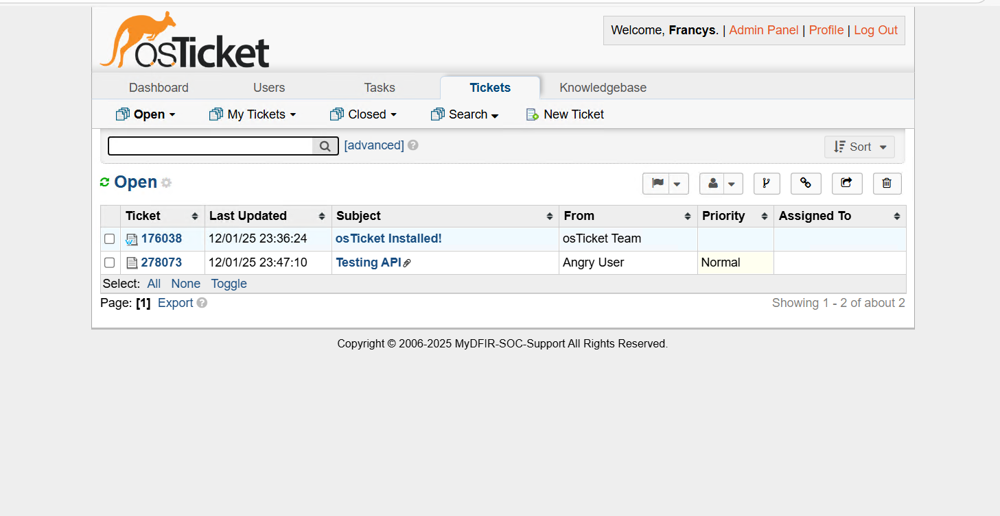
*Ticket gerado automaticamente no osTicket via gatilho do SIEM.*

---

### ⚠️ Desafios e Soluções (Troubleshooting Crítico de Integração)

Esta fase apresentou erros críticos que exigiram reconstrução de infraestrutura e recuperação de banco de dados.

#### 1. Corrupção de Banco de Dados (MySQL InnoDB)
Após um reinício forçado do servidor (devido a travamento por falta de recursos), o serviço MySQL falhou ao iniciar. Logs indicaram corrupção nos arquivos de transação (`ib_logfile`).
* **Diagnóstico:** O desligamento abrupto corrompeu a integridade do InnoDB, impedindo o *startup* do banco e o login na aplicação (`Authentication Required`).
* **Solução:** Tentei a recuperação via limpeza de logs temporários, mas a corrupção era estrutural. Optei por realizar uma **reinstalação limpa (Clean Re-install)** da stack XAMPP e recriação do banco de dados `osticket_db`, restaurando o serviço em menos tempo do que uma recuperação forense de banco exigiria.

#### 2. Conflito de Instalação (Diretório Sujo)
Durante a reinstalação, o instalador falhou devido a resíduos da instalação anterior.
* **Solução:** Realizei a limpeza manual do diretório `C:\xampp` e forcei a remoção de processos travados para garantir um *deploy* limpo.

#### 3. Erro de Autenticação API (403/401)
Inicialmente, os testes de conexão falhavam.
* **Diagnóstico:** Identifiquei que o conector do Elastic não enviava a API Key no formato esperado pela autenticação básica.
* **Solução:** Configurei manualmente o *Header* HTTP `X-API-Key` no conector do Kibana, garantindo que a credencial fosse passada corretamente para o gateway do osTicket.

---

## 📌 Fase 17: Investigação de Incidente e Threat Hunting 

Ao receber o alerta de **SSH Brute Force**, iniciei o processo manual de investigação para determinar a extensão e o impacto do ataque. Segui o *playbook* de resposta a incidentes para responder a quatro perguntas críticas:

### 1. Investigação do Atacante (Threat Intelligence)
**P:** Este IP é conhecido por atividades maliciosas?
**R:** Sim.
* **Evidência:** Consultei o IP `77.83.207.205` no **AbuseIPDB**. O endereço possui "Confidence of Abuse: 100%", sendo reportado centenas de vezes por ataques de força bruta globalmente.

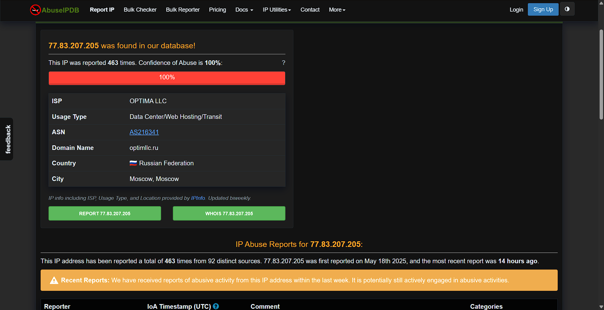
*Consulta de reputação confirmando a origem maliciosa do IP.*

### 2. Análise de Escopo (Scope Analysis)
**P:** Outros usuários foram afetados além do `root`?
**R:** Sim.
* **Evidência:** Filtrando os logs no Kibana Discover pelo IP do atacante, identifiquei tentativas de login para diversos usuários genéricos, incluindo `admin`, `test`, `user`, `guest`. Isso indica um ataque de dicionário amplo (spray), e não um ataque direcionado a uma credencial específica.

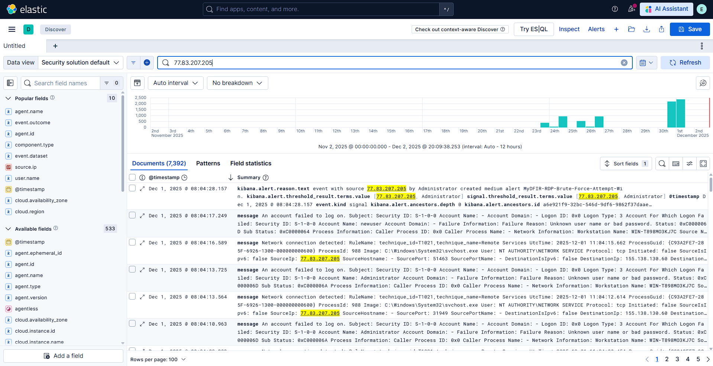
*Análise de logs no Discover revelando o padrão de tentativa de múltiplos usuários.*

### 3. Avaliação de Impacto (Containment)
**P:** Alguma tentativa obteve sucesso?
**R:** **Não.**
* **Metodologia:** Realizei uma query de busca por `event.outcome: "success"` filtrando pelo IP do atacante. O retorno foi de **0 eventos**.

**P:** Houve atividade pós-exploração?
**R:** **N/A.** Como não houve sucesso no login, não houve execução de comandos ou movimentação lateral.

---
**Conclusão da Análise:** Tentativa de acesso não autorizado falha. O bloqueio de firewall e senhas fortes foram eficazes. Incidente classificado como **Tentativa de Intrusão (Nível Baixo/Monitoramento)**.
---
## 📌 Fase 18: Investigação Profunda e Encerramento

Após validar a tentativa de força bruta, aprofundei a investigação para responder à pergunta crítica: **"O ataque obteve sucesso?"**

### 1. Caça ao Sucesso (Hunting for Success)
Filtrei os logs no SIEM buscando pelo **Event ID 4624** (Login Sucesso) correlacionado com o IP do atacante identificado anteriormente.
* **Resultado:** Localizei múltiplos eventos de sucesso às 12:37, coincidindo com o fim da tentativa de força bruta.
* **Significado:** O atacante conseguiu descobrir a senha e comprometer a conta `Administrator`.

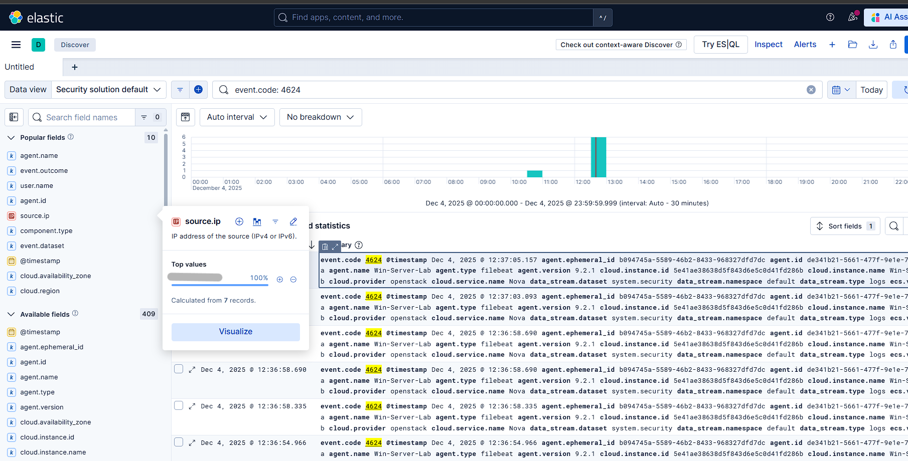
*Identificação visual no Elastic: picos de eventos 4624 originados pelo IP do atacante.*

### 2. Análise da Evidência
Ao expandir os logs, confirmei os detalhes da intrusão. O sistema registrou o **Logon Type 10** (Acesso Remoto/RDP) ou **Logon Type 3** (Rede), validando que a credencial foi usada externamente.

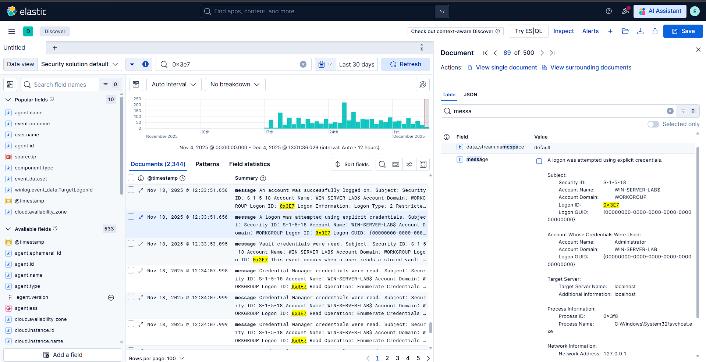
*Detalhes do evento mostrando o acesso bem-sucedido à conta de Administrador.*

### 3. Contenção e Documentação
Com a confirmação da invasão, iniciei o protocolo de resposta a incidentes:
1.  **Criação de Ticket:** Registrei o incidente no **osTicket** detalhando a detecção.
2.  **Mitigação:** (Simulado) Reset da senha de Administrador e bloqueio do IP no Firewall.
3.  **Conclusão:** O ticket foi atualizado com as evidências e marcado como "Fechado".

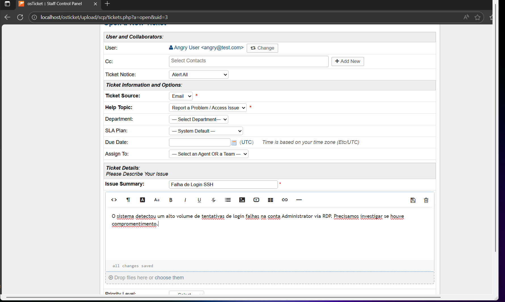
*Registro formal do incidente no sistema de tickets para rastreabilidade.*

---
**STATUS ATUAL DO PROJETO:**
O ciclo manual de ataque e defesa foi concluído.
* **Ataque:** Realizado (Brute Force).
* **Detecção:** Confirmada (Elastic SIEM).
* **Gestão:** Documentada (osTicket).

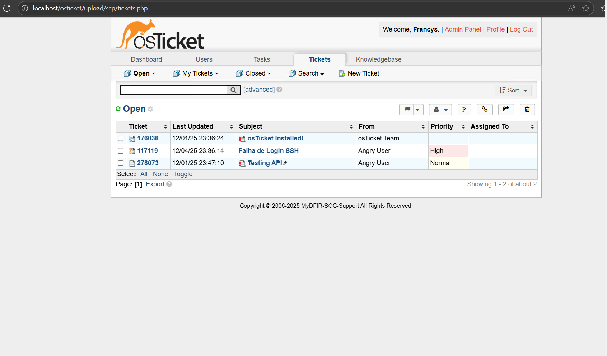
*Visão da fila de tickets demonstrando o fluxo de trabalho do analista.*

📌 Fase 19: Implementação de SOAR (Security Orchestration, Automation and Response)
Para reduzir o tempo de resposta (MTTR), integrei o Elastic SIEM a uma plataforma SOAR (Tines). O objetivo foi automatizar a notificação de alertas críticos, eliminando a necessidade de monitoramento visual constante.

1. Construção do Storyboard
Criei um fluxo de automação composto por três estágios principais:

Webhook: Recebimento do alerta enviado pelo Elastic.

Data Parsing: Tratamento do JSON bruto para extrair campos vitais (Nome da Regra, Host, Usuário, Comando Malicioso).

Action (Email): Envio dinâmico de notificação para o analista.

Arquitetura da automação no Tines conectando o SIEM ao sistema de notificação.

📌 Fase 20: Simulação de Ameaça Avançada (PowerShell/C2)
Diferente do ataque de força bruta (barulhento), simulei uma técnica mais furtiva e comum em estágios de pós-exploração: a execução de comandos codificados em Base64 via PowerShell (T1059.001 no MITRE ATT&CK).

1. O Ataque
Utilizei um payload codificado para ofuscar o comando malicioso, tentando evadir detecções baseadas em assinaturas simples de texto.

PowerShell

powershell.exe -EncodedCommand JABzACAAPQAgAE4AZQB3AC0ATwBiAGoAZQBjAHQAIABJAE8ALgBNAGUAbQBvAHIAeQBTAHQAcgBlAGEAbQAoAFsAQwBvAG4AdgBlAHIAdABdADoAOgBGAH...
(Nota: O comando real foi executado no ambiente controlado).

2. A Detecção (Regra Customizada)
Configurei uma regra de detecção no Elastic baseada na query process.command_line: *EncodedCommand*. A regra identificou a anomalia imediatamente após a execução.

SIEM detectando a execução do processo suspeito via command line.

📌 Fase 21: Validação do Ciclo Completo (End-to-End)
O teste final consistiu em disparar o ataque e verificar se a automação funcionaria sem intervenção humana.

1. Resultado da Automação
Segundos após a detecção no Elastic, o Tines processou o evento e enviou um e-mail formatado contendo os detalhes críticos do incidente. Isso prova a capacidade de resposta em tempo real.

E-mail recebido automaticamente contendo a regra disparada, o usuário e o comando malicioso.

📌 Fase 22: Reporting e Encerramento
Para finalizar o laboratório e garantir a preservação das evidências forenses, gerei relatórios dos incidentes confirmados.

1. Exportação de Dados
Filtrei os logs no Discover para isolar apenas os eventos de alta fidelidade (PowerShell Encoded e Sucesso de Login) e exportei os dados em formato CSV para auditoria futura.

Filtro aplicado no Discover para exportação das evidências finais.

🏁 Conclusão do Projeto
O laboratório demonstrou com sucesso a criação de um ecossistema de segurança defensiva funcional, cobrindo:

Ingestão de Logs: Windows e Linux enviando telemetria para a nuvem.

Visibilidade: Dashboards e Mapas em tempo real.

Detecção: Regras para Brute Force e Execução de Processos.

Resposta: Automação via SOAR para alertas imediatos.
